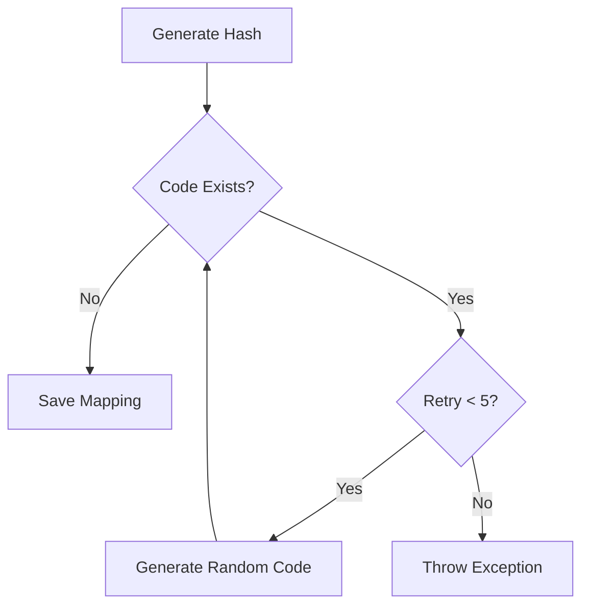

# Design Document: URL Shortener Service

## Overview

The URL Shortener Service is a Spring Boot application that provides URL shortening capabilities with analytics tracking. The system accepts long URLs, generates unique short codes using a hash-based algorithm with collision handling, stores mappings in a relational database (PostgreSQL or H2), and provides HTTP redirect services with comprehensive click analytics.

The architecture follows a layered approach with clear separation between the REST API layer, business logic layer, and data persistence layer. The system prioritizes performance for redirects while ensuring accurate analytics tracking through asynchronous event processing.

## Architecture

### System Components

```mermaid
graph TB
    Client[Client/Browser]
    API[REST API Layer]
    URLService[URL Service]
    RedirectService[Redirect Service]
    AnalyticsService[Analytics Service]
    HashGenerator[Hash Generator]
    Validator[URL Validator]
    DB[(Database)]
    
    Client -->|POST /api/shorten| API
    Client -->|GET /{shortCode}| API
    Client -->|GET /api/stats/{shortCode}| API
    
    API --> URLService
    API --> RedirectService
    API --> AnalyticsService
    
    URLService --> HashGenerator
    URLService --> Validator
    URLService --> DB
    
    RedirectService --> DB
    RedirectService --> AnalyticsService
    
    AnalyticsService --> DB
```

### Component Responsibilities

1. **REST API Layer**: Handles HTTP requests, request validation, and response formatting
2. **URL Service**: Manages URL shortening logic, hash generation, and collision handling
3. **Redirect Service**: Handles URL lookups and HTTP redirects
4. **Analytics Service**: Tracks click events and provides statistics
5. **Hash Generator**: Generates unique short codes using hash algorithms
6. **URL Validator**: Validates URL format and structure
7. **Database Layer**: Persists URL mappings and analytics data

### Technology Stack

- **Framework**: Spring Boot 3.x
- **Database**: PostgreSQL (production) / H2 (development/testing)
- **ORM**: Spring Data JPA
- **Build Tool**: Maven 
- **Java Version**: 17 or higher

## Components and Interfaces

### REST API Endpoints

#### 1. Create Short URL
```
POST /api/shorten
Content-Type: application/json

Request Body:
{
  "url": "https://example.com/very/long/url/path"
}

Response (201 Created):
{
  "shortCode": "abc123",
  "shortUrl": "http://localhost:8080/abc123",
  "originalUrl": "https://example.com/very/long/url/path",
  "createdAt": "2024-01-15T10:30:00Z"
}

Response (400 Bad Request):
{
  "error": "Invalid URL format",
  "message": "URL must include a valid protocol (http or https)"
}
```

#### 2. Redirect to Original URL
```
GET /{shortCode}

Response (301 Moved Permanently):
Location: https://example.com/very/long/url/path

Response (404 Not Found):
{
  "error": "Short URL not found",
  "message": "The short code 'xyz789' does not exist"
}
```

#### 3. Get URL Statistics
```
GET /api/stats/{shortCode}

Response (200 OK):
{
  "shortCode": "abc123",
  "originalUrl": "https://example.com/very/long/url/path",
  "totalClicks": 42,
  "createdAt": "2024-01-15T10:30:00Z",
  "firstAccessAt": "2024-01-15T11:00:00Z",
  "lastAccessAt": "2024-01-16T14:22:00Z"
}

Response (404 Not Found):
{
  "error": "Short URL not found"
}
```

#### 4. Get Click History
```
GET /api/stats/{shortCode}/history?page=0&size=20

Response (200 OK):
{
  "shortCode": "abc123",
  "totalClicks": 42,
  "clicks": [
    {
      "timestamp": "2024-01-16T14:22:00Z"
    },
    {
      "timestamp": "2024-01-16T13:15:00Z"
    }
  ],
  "page": 0,
  "size": 20,
  "totalPages": 3
}
```

### Core Services

#### URLService Interface
```java
public interface URLService {
    /**
     * Creates a short URL for the given long URL
     * @param longUrl the original URL to shorten
     * @return ShortenedUrlDto containing the short code and metadata
     * @throws InvalidUrlException if the URL is invalid
     * @throws ShortCodeGenerationException if unable to generate unique code
     */
    ShortenedUrlDto createShortUrl(String longUrl);
    
    /**
     * Retrieves the original URL for a given short code
     * @param shortCode the short code to lookup
     * @return Optional containing the long URL if found
     */
    Optional<String> getLongUrl(String shortCode);
}
```

#### RedirectService Interface
```java
public interface RedirectService {
    /**
     * Handles redirect logic for a short code
     * @param shortCode the short code to redirect
     * @return RedirectResponse containing the target URL and HTTP status
     * @throws ShortUrlNotFoundException if short code doesn't exist
     */
    RedirectResponse handleRedirect(String shortCode);
}
```

#### AnalyticsService Interface
```java
public interface AnalyticsService {
    /**
     * Records a click event for a short code
     * @param shortCode the short code that was accessed
     */
    void recordClick(String shortCode);
    
    /**
     * Retrieves statistics for a short code
     * @param shortCode the short code to get stats for
     * @return UrlStatistics containing click counts and timestamps
     * @throws ShortUrlNotFoundException if short code doesn't exist
     */
    UrlStatistics getStatistics(String shortCode);
    
    /**
     * Retrieves paginated click history
     * @param shortCode the short code to get history for
     * @param page page number (0-indexed)
     * @param size number of records per page
     * @return ClickHistoryPage containing click events
     */
    ClickHistoryPage getClickHistory(String shortCode, int page, int size);
}
```

#### HashGenerator Interface
```java
public interface HashGenerator {
    /**
     * Generates a short code from a long URL
     * @param longUrl the URL to hash
     * @return a short alphanumeric code (6-10 characters)
     */
    String generateShortCode(String longUrl);
    
    /**
     * Generates a random short code (used for collision resolution)
     * @return a random alphanumeric code (6-10 characters)
     */
    String generateRandomCode();
}
```

#### URLValidator Interface
```java
public interface URLValidator {
    /**
     * Validates a URL format and structure
     * @param url the URL to validate
     * @return ValidationResult containing validation status and errors
     */
    ValidationResult validate(String url);
}
```

## Data Models

### Database Schema

#### url_mappings Table
```sql
CREATE TABLE url_mappings (
    id BIGSERIAL PRIMARY KEY,
    short_code VARCHAR(10) UNIQUE NOT NULL,
    long_url VARCHAR(2048) NOT NULL,
    created_at TIMESTAMP NOT NULL DEFAULT CURRENT_TIMESTAMP,
    INDEX idx_short_code (short_code)
);
```

#### click_events Table
```sql
CREATE TABLE click_events (
    id BIGSERIAL PRIMARY KEY,
    short_code VARCHAR(10) NOT NULL,
    accessed_at TIMESTAMP NOT NULL DEFAULT CURRENT_TIMESTAMP,
    FOREIGN KEY (short_code) REFERENCES url_mappings(short_code),
    INDEX idx_short_code_accessed (short_code, accessed_at DESC)
);
```

### JPA Entities

#### UrlMapping Entity
```java
@Entity
@Table(name = "url_mappings")
public class UrlMapping {
    @Id
    @GeneratedValue(strategy = GenerationType.IDENTITY)
    private Long id;
    
    @Column(name = "short_code", unique = true, nullable = false, length = 10)
    private String shortCode;
    
    @Column(name = "long_url", nullable = false, length = 2048)
    private String longUrl;
    
    @Column(name = "created_at", nullable = false)
    private LocalDateTime createdAt;
    
    @OneToMany(mappedBy = "shortCode", cascade = CascadeType.ALL)
    private List<ClickEvent> clickEvents;
    
    // Getters, setters, constructors
}
```

#### ClickEvent Entity
```java
@Entity
@Table(name = "click_events")
public class ClickEvent {
    @Id
    @GeneratedValue(strategy = GenerationType.IDENTITY)
    private Long id;
    
    @Column(name = "short_code", nullable = false, length = 10)
    private String shortCode;
    
    @Column(name = "accessed_at", nullable = false)
    private LocalDateTime accessedAt;
    
    // Getters, setters, constructors
}
```

### DTOs

#### ShortenedUrlDto
```java
public class ShortenedUrlDto {
    private String shortCode;
    private String shortUrl;
    private String originalUrl;
    private LocalDateTime createdAt;
}
```

#### UrlStatistics
```java
public class UrlStatistics {
    private String shortCode;
    private String originalUrl;
    private long totalClicks;
    private LocalDateTime createdAt;
    private LocalDateTime firstAccessAt;
    private LocalDateTime lastAccessAt;
}
```

#### ClickHistoryPage
```java
public class ClickHistoryPage {
    private String shortCode;
    private long totalClicks;
    private List<ClickRecord> clicks;
    private int page;
    private int size;
    private int totalPages;
}
```

## Hash Generation Algorithm

### Strategy

The system uses a hybrid approach combining hash-based generation with random fallback:

1. **Primary Method**: MD5 hash of the long URL, encoded to Base62 (alphanumeric), truncated to 7 characters
2. **Collision Resolution**: Generate random Base62 strings of 7 characters
3. **Retry Logic**: Up to 5 attempts before failing

### Implementation Details

```java
public class Base62HashGenerator implements HashGenerator {
    private static final String BASE62_CHARS = 
        "0123456789ABCDEFGHIJKLMNOPQRSTUVWXYZabcdefghijklmnopqrstuvwxyz";
    private static final int SHORT_CODE_LENGTH = 7;
    
    @Override
    public String generateShortCode(String longUrl) {
        try {
            MessageDigest md = MessageDigest.getInstance("MD5");
            byte[] hash = md.digest(longUrl.getBytes(StandardCharsets.UTF_8));
            return encodeBase62(hash).substring(0, SHORT_CODE_LENGTH);
        } catch (NoSuchAlgorithmException e) {
            return generateRandomCode();
        }
    }
    
    @Override
    public String generateRandomCode() {
        SecureRandom random = new SecureRandom();
        StringBuilder code = new StringBuilder(SHORT_CODE_LENGTH);
        for (int i = 0; i < SHORT_CODE_LENGTH; i++) {
            code.append(BASE62_CHARS.charAt(random.nextInt(BASE62_CHARS.length())));
        }
        return code.toString();
    }
    
    private String encodeBase62(byte[] input) {
        BigInteger num = new BigInteger(1, input);
        StringBuilder encoded = new StringBuilder();
        while (num.compareTo(BigInteger.ZERO) > 0) {
            int remainder = num.mod(BigInteger.valueOf(62)).intValue();
            encoded.insert(0, BASE62_CHARS.charAt(remainder));
            num = num.divide(BigInteger.valueOf(62));
        }
        return encoded.toString();
    }
}
```

### Collision Handling Flow



## URL Validation

### Validation Rules

1. **Protocol**: Must start with `http://` or `https://`
2. **Domain**: Must contain valid domain name (alphanumeric, hyphens, dots)
3. **Length**: Maximum 2048 characters
4. **Characters**: Must not contain control characters or spaces
5. **Format**: Must match URL regex pattern

### Implementation

```java
public class UrlValidatorImpl implements URLValidator {
    private static final int MAX_URL_LENGTH = 2048;
    private static final Pattern URL_PATTERN = Pattern.compile(
        "^(https?://)([a-zA-Z0-9-]+\\.)+[a-zA-Z]{2,}(/.*)?$"
    );
    
    @Override
    public ValidationResult validate(String url) {
        List<String> errors = new ArrayList<>();
        
        if (url == null || url.trim().isEmpty()) {
            errors.add("URL cannot be empty");
            return ValidationResult.invalid(errors);
        }
        
        if (url.length() > MAX_URL_LENGTH) {
            errors.add("URL exceeds maximum length of " + MAX_URL_LENGTH);
        }
        
        if (!url.startsWith("http://") && !url.startsWith("https://")) {
            errors.add("URL must start with http:// or https://");
        }
        
        if (!URL_PATTERN.matcher(url).matches()) {
            errors.add("URL format is invalid");
        }
        
        return errors.isEmpty() ? 
            ValidationResult.valid() : 
            ValidationResult.invalid(errors);
    }
}
```


## Correctness Properties

A property is a characteristic or behavior that should hold true across all valid executions of a system—essentially, a formal statement about what the system should do. Properties serve as the bridge between human-readable specifications and machine-verifiable correctness guarantees.

### Property 1: Short Code Generation Invariants

*For any* valid long URL, when a short code is generated, the code should be between 6 and 10 characters in length and contain only alphanumeric characters (a-z, A-Z, 0-9).

**Validates: Requirements 1.1, 1.5, 1.6**

### Property 2: URL Shortening Round Trip

*For any* valid long URL, shortening it to get a short code and then retrieving the long URL using that short code should return the original URL.

**Validates: Requirements 1.2, 3.1**

### Property 3: Idempotent URL Shortening

*For any* valid long URL, shortening it multiple times should always return the same short code.

**Validates: Requirements 1.3**

### Property 4: Invalid URL Rejection

*For any* invalid URL (missing protocol, invalid domain, malformed syntax, or invalid characters), the URL_Shortener should reject it with a validation error.

**Validates: Requirements 1.4, 4.1, 4.2, 4.3**

### Property 5: Successful Shortening Response Format

*For any* valid long URL that is successfully shortened, the response should have HTTP status 201 and include both the short code and the full shortened URL.

**Validates: Requirements 2.2, 2.5**

### Property 6: Error Response Format

*For any* request that fails validation or processing, the response should include an appropriate HTTP error status and descriptive error details.

**Validates: Requirements 2.3**

### Property 7: Non-existent Short Code Handling

*For any* short code that does not exist in the database, requesting a redirect should return HTTP 404 with an error message.

**Validates: Requirements 3.2, 7.3**

### Property 8: Stored URL Validity

*For any* URL mapping stored in the database, the long URL should remain in a valid format (valid protocol and domain).

**Validates: Requirements 3.3**

### Property 9: Click Event Recording

*For any* successful redirect, a click event should be recorded with the correct short code, an incremented click counter, and a timestamp.

**Validates: Requirements 3.4, 5.1, 5.2, 5.5**

### Property 10: Chronological Click Logging

*For any* sequence of click events for a short code, when querying the access logs, the results should be ordered chronologically by timestamp with millisecond precision.

**Validates: Requirements 6.1, 6.2, 6.5**

### Property 11: Statistics Calculation Accuracy

*For any* short code with recorded clicks, the statistics should accurately report the total click count, first access timestamp, and most recent access timestamp based on the click events.

**Validates: Requirements 7.6**

### Property 12: Pagination Consistency

*For any* short code with click history, paginating through all pages should return all click events exactly once without duplicates or omissions.

**Validates: Requirements 7.5**

### Property 13: Collision Resolution

*For any* hash collision scenario where a generated short code already exists, the system should generate a new unique code rather than overwriting the existing mapping.

**Validates: Requirements 9.1**

## Error Handling

### Error Categories

1. **Validation Errors (400 Bad Request)**
   - Invalid URL format
   - Missing required fields
   - URL exceeds maximum length
   - Invalid characters in URL

2. **Not Found Errors (404 Not Found)**
   - Short code does not exist
   - Statistics requested for non-existent URL

3. **Server Errors (500 Internal Server Error)**
   - Database connection failures
   - Hash generation failures
   - Collision retry limit exceeded

### Error Response Format

All errors follow a consistent JSON structure:

```json
{
  "error": "Short error title",
  "message": "Detailed error description",
  "timestamp": "2024-01-15T10:30:00Z",
  "path": "/api/shorten"
}
```

### Exception Handling Strategy

```java
@ControllerAdvice
public class GlobalExceptionHandler {
    
    @ExceptionHandler(InvalidUrlException.class)
    public ResponseEntity<ErrorResponse> handleInvalidUrl(InvalidUrlException ex) {
        return ResponseEntity
            .status(HttpStatus.BAD_REQUEST)
            .body(new ErrorResponse("Invalid URL", ex.getMessage()));
    }
    
    @ExceptionHandler(ShortUrlNotFoundException.class)
    public ResponseEntity<ErrorResponse> handleNotFound(ShortUrlNotFoundException ex) {
        return ResponseEntity
            .status(HttpStatus.NOT_FOUND)
            .body(new ErrorResponse("Short URL not found", ex.getMessage()));
    }
    
    @ExceptionHandler(ShortCodeGenerationException.class)
    public ResponseEntity<ErrorResponse> handleGenerationFailure(
            ShortCodeGenerationException ex) {
        return ResponseEntity
            .status(HttpStatus.INTERNAL_SERVER_ERROR)
            .body(new ErrorResponse("Code generation failed", ex.getMessage()));
    }
    
    @ExceptionHandler(Exception.class)
    public ResponseEntity<ErrorResponse> handleGenericError(Exception ex) {
        return ResponseEntity
            .status(HttpStatus.INTERNAL_SERVER_ERROR)
            .body(new ErrorResponse("Internal server error", 
                "An unexpected error occurred"));
    }
}
```

### Retry Logic

For collision handling, implement exponential backoff:

```java
public String generateUniqueShortCode(String longUrl) {
    int maxRetries = 5;
    int attempt = 0;
    
    while (attempt < maxRetries) {
        String shortCode = attempt == 0 ? 
            hashGenerator.generateShortCode(longUrl) :
            hashGenerator.generateRandomCode();
            
        if (!urlRepository.existsByShortCode(shortCode)) {
            return shortCode;
        }
        
        attempt++;
    }
    
    throw new ShortCodeGenerationException(
        "Unable to generate unique short code after " + maxRetries + " attempts");
}
```

## Testing Strategy

### Dual Testing Approach

The testing strategy employs both unit tests and property-based tests to ensure comprehensive coverage:

- **Unit tests**: Verify specific examples, edge cases, and error conditions
- **Property tests**: Verify universal properties across all inputs using randomized testing

Both approaches are complementary and necessary. Unit tests catch concrete bugs in specific scenarios, while property tests verify general correctness across a wide range of inputs.

### Property-Based Testing

**Framework**: Use **jqwik** for Java property-based testing

**Configuration**: Each property test should run a minimum of 100 iterations to ensure thorough coverage through randomization.

**Test Tagging**: Each property-based test must include a comment referencing the design document property:

```java
// Feature: acortador-urls, Property 2: URL Shortening Round Trip
@Property
void shorteningAndRetrievingUrlShouldReturnOriginal(@ForAll("validUrls") String url) {
    // Test implementation
}
```

**Property Test Examples**:

```java
class UrlShortenerPropertyTests {
    
    // Feature: acortador-urls, Property 1: Short Code Generation Invariants
    @Property(tries = 100)
    void generatedShortCodesShouldMeetFormatRequirements(
            @ForAll("validUrls") String url) {
        String shortCode = urlService.createShortUrl(url).getShortCode();
        
        assertThat(shortCode.length()).isBetween(6, 10);
        assertThat(shortCode).matches("[a-zA-Z0-9]+");
    }
    
    // Feature: acortador-urls, Property 2: URL Shortening Round Trip
    @Property(tries = 100)
    void shortenedUrlShouldRetrieveOriginalUrl(
            @ForAll("validUrls") String url) {
        String shortCode = urlService.createShortUrl(url).getShortCode();
        Optional<String> retrieved = urlService.getLongUrl(shortCode);
        
        assertThat(retrieved).isPresent();
        assertThat(retrieved.get()).isEqualTo(url);
    }
    
    // Feature: acortador-urls, Property 3: Idempotent URL Shortening
    @Property(tries = 100)
    void shorteningSameUrlMultipleTimesShouldReturnSameCode(
            @ForAll("validUrls") String url) {
        String firstCode = urlService.createShortUrl(url).getShortCode();
        String secondCode = urlService.createShortUrl(url).getShortCode();
        
        assertThat(firstCode).isEqualTo(secondCode);
    }
    
    // Feature: acortador-urls, Property 4: Invalid URL Rejection
    @Property(tries = 100)
    void invalidUrlsShouldBeRejected(
            @ForAll("invalidUrls") String url) {
        assertThatThrownBy(() -> urlService.createShortUrl(url))
            .isInstanceOf(InvalidUrlException.class);
    }
    
    @Provide
    Arbitrary<String> validUrls() {
        return Arbitraries.strings()
            .withPrefix("https://")
            .withSuffix(".com/path")
            .alpha().numeric()
            .ofMinLength(10)
            .ofMaxLength(100);
    }
    
    @Provide
    Arbitrary<String> invalidUrls() {
        return Arbitraries.oneOf(
            Arbitraries.strings().withoutPrefix("http"),  // No protocol
            Arbitraries.just("http://"),                   // No domain
            Arbitraries.just("not a url at all")          // Malformed
        );
    }
}
```

### Unit Testing

**Framework**: JUnit 5 with Spring Boot Test

**Focus Areas**:
- Specific examples demonstrating correct behavior
- Edge cases (maximum URL length, boundary conditions)
- Error conditions and exception handling
- Integration between components

**Unit Test Examples**:

```java
@SpringBootTest
class UrlShortenerServiceTest {
    
    @Autowired
    private URLService urlService;
    
    @Test
    void shouldCreateShortUrlForValidInput() {
        String longUrl = "https://example.com/very/long/path";
        
        ShortenedUrlDto result = urlService.createShortUrl(longUrl);
        
        assertThat(result.getShortCode()).isNotEmpty();
        assertThat(result.getOriginalUrl()).isEqualTo(longUrl);
        assertThat(result.getShortUrl()).contains(result.getShortCode());
    }
    
    @Test
    void shouldRejectUrlWithoutProtocol() {
        String invalidUrl = "example.com/path";
        
        assertThatThrownBy(() -> urlService.createShortUrl(invalidUrl))
            .isInstanceOf(InvalidUrlException.class)
            .hasMessageContaining("protocol");
    }
    
    @Test
    void shouldRejectUrlExceedingMaxLength() {
        String longUrl = "https://example.com/" + "a".repeat(2100);
        
        assertThatThrownBy(() -> urlService.createShortUrl(longUrl))
            .isInstanceOf(InvalidUrlException.class)
            .hasMessageContaining("maximum length");
    }
    
    @Test
    void shouldHandleCollisionRetryLimit() {
        // Mock scenario where all generated codes collide
        // Verify exception is thrown after 5 retries
    }
}

@SpringBootTest
class RedirectServiceTest {
    
    @Autowired
    private RedirectService redirectService;
    
    @Autowired
    private URLService urlService;
    
    @Test
    void shouldRedirectToOriginalUrl() {
        String longUrl = "https://example.com/target";
        String shortCode = urlService.createShortUrl(longUrl).getShortCode();
        
        RedirectResponse response = redirectService.handleRedirect(shortCode);
        
        assertThat(response.getTargetUrl()).isEqualTo(longUrl);
        assertThat(response.getStatusCode()).isIn(301, 302);
    }
    
    @Test
    void shouldReturn404ForNonExistentCode() {
        assertThatThrownBy(() -> redirectService.handleRedirect("invalid"))
            .isInstanceOf(ShortUrlNotFoundException.class);
    }
}

@SpringBootTest
class AnalyticsServiceTest {
    
    @Autowired
    private AnalyticsService analyticsService;
    
    @Autowired
    private URLService urlService;
    
    @Test
    void shouldIncrementClickCountOnAccess() {
        String shortCode = urlService.createShortUrl("https://example.com").getShortCode();
        
        analyticsService.recordClick(shortCode);
        analyticsService.recordClick(shortCode);
        
        UrlStatistics stats = analyticsService.getStatistics(shortCode);
        assertThat(stats.getTotalClicks()).isEqualTo(2);
    }
    
    @Test
    void shouldReturnClickHistoryInChronologicalOrder() {
        String shortCode = urlService.createShortUrl("https://example.com").getShortCode();
        
        analyticsService.recordClick(shortCode);
        Thread.sleep(10);
        analyticsService.recordClick(shortCode);
        
        ClickHistoryPage history = analyticsService.getClickHistory(shortCode, 0, 10);
        
        assertThat(history.getClicks()).hasSize(2);
        assertThat(history.getClicks().get(0).getTimestamp())
            .isAfter(history.getClicks().get(1).getTimestamp());
    }
    
    @Test
    void shouldPaginateClickHistoryCorrectly() {
        String shortCode = urlService.createShortUrl("https://example.com").getShortCode();
        
        for (int i = 0; i < 25; i++) {
            analyticsService.recordClick(shortCode);
        }
        
        ClickHistoryPage page1 = analyticsService.getClickHistory(shortCode, 0, 10);
        ClickHistoryPage page2 = analyticsService.getClickHistory(shortCode, 1, 10);
        
        assertThat(page1.getClicks()).hasSize(10);
        assertThat(page2.getClicks()).hasSize(10);
        assertThat(page1.getTotalPages()).isEqualTo(3);
    }
}
```

### Integration Testing

Test the complete flow from API endpoint to database:

```java
@SpringBootTest(webEnvironment = WebEnvironment.RANDOM_PORT)
@AutoConfigureMockMvc
class UrlShortenerIntegrationTest {
    
    @Autowired
    private MockMvc mockMvc;
    
    @Test
    void shouldCreateAndRedirectShortUrl() throws Exception {
        String longUrl = "https://example.com/test";
        
        // Create short URL
        MvcResult createResult = mockMvc.perform(post("/api/shorten")
                .contentType(MediaType.APPLICATION_JSON)
                .content("{\"url\":\"" + longUrl + "\"}"))
            .andExpect(status().isCreated())
            .andExpect(jsonPath("$.shortCode").exists())
            .andReturn();
        
        String shortCode = JsonPath.read(createResult.getResponse().getContentAsString(), 
            "$.shortCode");
        
        // Test redirect
        mockMvc.perform(get("/" + shortCode))
            .andExpect(status().is3xxRedirection())
            .andExpect(header().string("Location", longUrl));
        
        // Verify analytics
        mockMvc.perform(get("/api/stats/" + shortCode))
            .andExpect(status().isOk())
            .andExpect(jsonPath("$.totalClicks").value(1));
    }
}
```

### Test Coverage Goals

- **Line Coverage**: Minimum 80%
- **Branch Coverage**: Minimum 75%
- **Property Tests**: All 13 correctness properties implemented
- **Unit Tests**: All edge cases and error conditions covered
- **Integration Tests**: All API endpoints and end-to-end flows covered

### Continuous Integration

Tests should run automatically on:
- Every commit (unit tests + property tests)
- Pull requests (full test suite including integration tests)
- Nightly builds (extended property test runs with 1000+ iterations)
